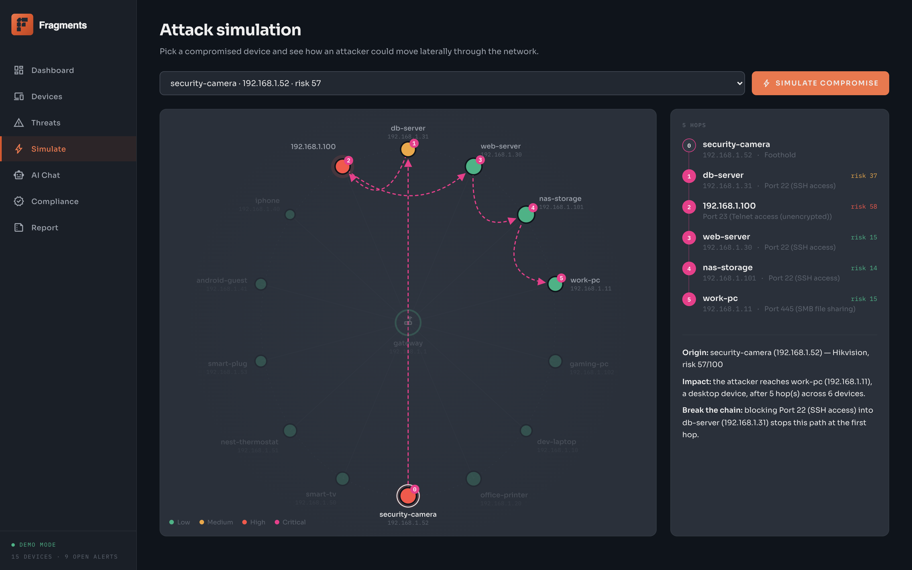
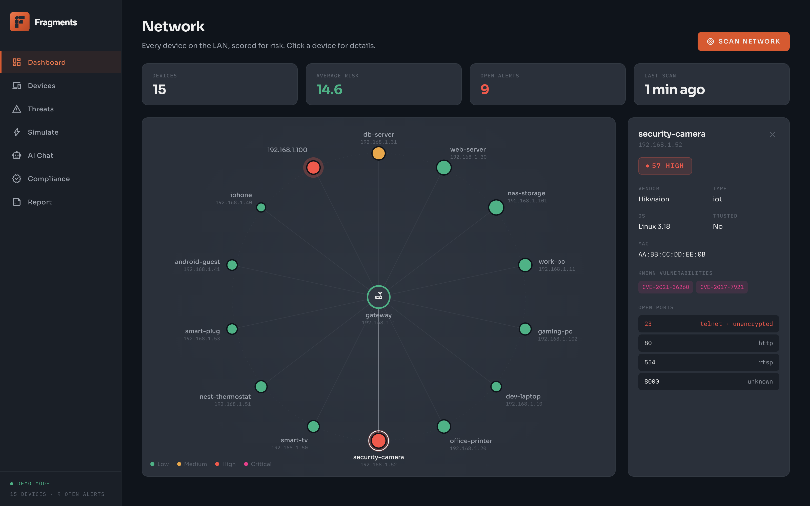
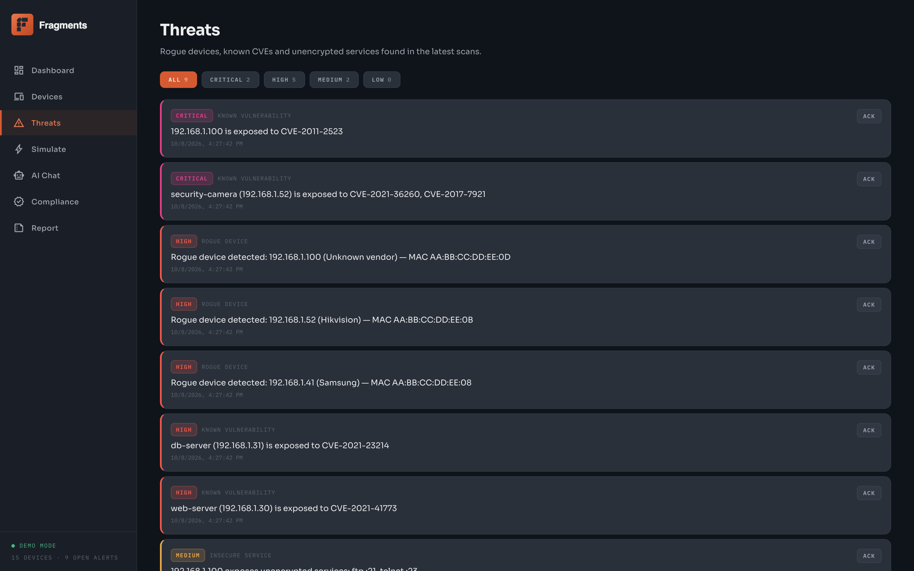
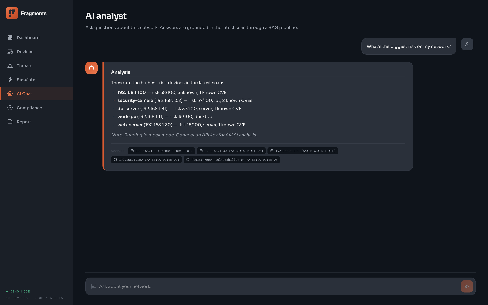
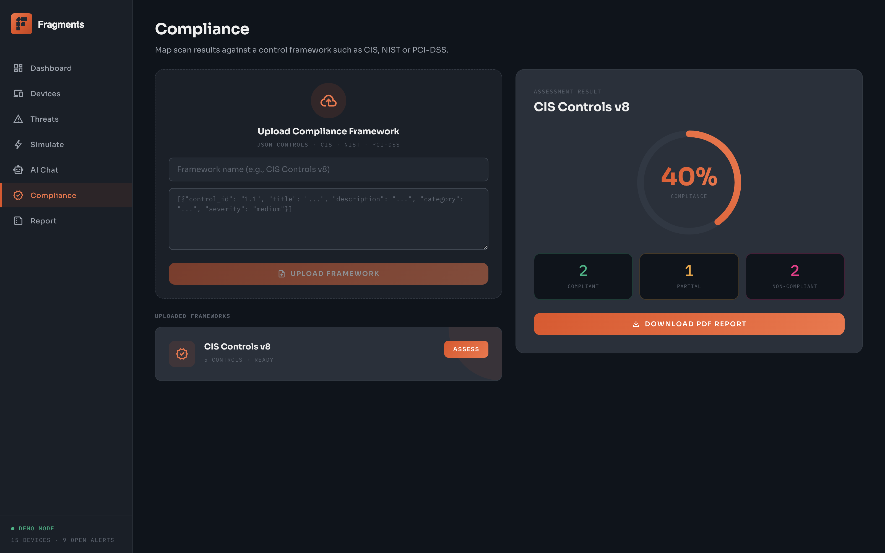
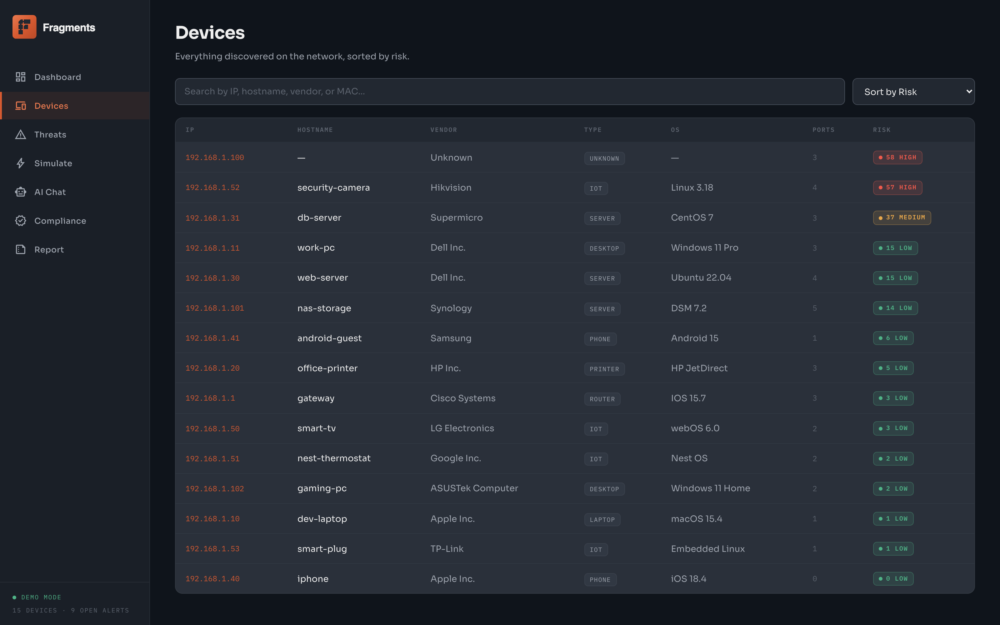
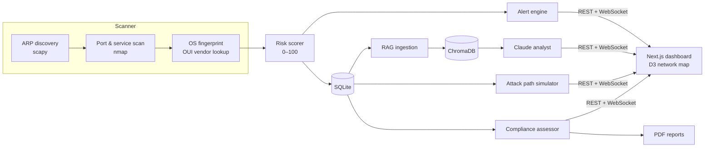

# Fragments

**AI-powered network security for your LAN.** Fragments discovers every device on a network, scores each one for risk, shows how an attacker could move between them, and lets you question the results in plain English.



<p>
  
  
  
  
  
  
</p>

---

## Features

### Live network map
ARP discovery, port scanning and OS fingerprinting build a map of every device on the subnet. Each node is coloured by its 0–100 risk score. Click a node to see its open ports, unencrypted services and known CVEs (linked to NVD).



### Attack path simulation
Choose a device and assume it has been compromised. Fragments works out how an attacker could move laterally, picking each next hop by the services it exposes, then draws the path on the map and names the single hop that would break the chain.

### Threat feed
Every scan raises deduplicated alerts for rogue (untrusted) devices, devices with known CVEs, and unencrypted services such as Telnet and FTP. Alerts are ranked by severity.



### AI analyst (RAG)
Scan results are embedded into ChromaDB after every scan. Questions are answered by Claude using the retrieved devices and alerts as context, and each answer lists the sources it drew on.



### Compliance assessment
Upload a control framework (CIS, NIST, PCI-DSS) as JSON. Fragments assesses each control against the current scan and exports a PDF report.



### Device inventory
A searchable, sortable list of every device with vendor, OS, port count and risk.



---

## Try it in two minutes

Demo mode needs no root access, no network scanning and no API key. It loads 15 synthetic devices, including a misconfigured camera, a rogue host with a backdoored FTP server and a database on an end-of-life OS, plus a sample CIS framework.

**Requirements:** Python 3.11+ and Node 20+.

```bash
# Backend (from the repo root)
python3 -m venv backend/.venv
backend/.venv/bin/pip install -r backend/requirements.txt
FRAGMENTS_MOCK=1 backend/.venv/bin/uvicorn backend.main:app --port 8000

# Frontend (second terminal)
cd frontend
npm install
npm run dev
```

Open **http://localhost:3000**.

### Live mode

Live mode scans a real network. It needs `nmap`, root access for ARP and ICMP, and an Anthropic API key for the AI features.

```bash
export ANTHROPIC_API_KEY=sk-ant-...
export SCAN_SUBNET=192.168.1.0/24
sudo -E backend/.venv/bin/uvicorn backend.main:app --host 0.0.0.0 --port 8000
```

> Only scan networks you own or are authorised to test.

---

## How it works



### Risk scoring

Each device gets a score from 0 to 100, built from five signals:

| Signal | Max | What raises it |
|---|---|---|
| Open ports | 30 | Dangerous services weighted higher (Telnet, SMB, RDP, ADB, VNC, databases) |
| Known CVEs | 25 | 8 points per CVE matched against the device |
| OS currency | 20 | End-of-life systems (CentOS 7, Windows 7, Linux 3.x, …); unknown OS scores 10 |
| Identity | 15 | Missing hostname, unknown vendor, unrecognised device type |
| Insecure protocols | 10 | Telnet, FTP, TFTP, rlogin, SNMP |

Scores map to **Low** (0–20), **Medium** (21–50), **High** (51–75) and **Critical** (76–100).

---

## Tech stack

| Layer | Tools |
|---|---|
| Scanning | scapy, python-nmap, icmplib, manuf |
| API | FastAPI, WebSockets, SQLite |
| AI | Anthropic Claude, ChromaDB (RAG) |
| Reports | ReportLab (PDF) |
| Frontend | Next.js 16 (App Router), React 19, TypeScript, D3.js, Tailwind CSS 4 |

---

## Configuration

All variables are optional. `ANTHROPIC_API_KEY` is required only for AI features in live mode. Put them in `backend/.env`.

| Variable | Default | Purpose |
|---|---|---|
| `FRAGMENTS_MOCK` | `0` | `1` runs demo mode with synthetic devices |
| `SCAN_SUBNET` | `192.168.1.0/24` | CIDR to scan in live mode |
| `SCAN_INTERVAL` | `60` | Seconds between background scans |
| `ANTHROPIC_API_KEY` | — | Enables Claude for chat, attack narration and compliance |
| `LLM_MODEL` | `claude-sonnet-4-20250514` | Anthropic model ID |
| `DB_PATH` | `data/fragments.db` | SQLite path |
| `CHROMA_PERSIST_DIR` | `data/chroma` | ChromaDB directory |
| `CORS_ORIGINS` | `http://localhost:3000,http://127.0.0.1:3000` | Comma-separated origins allowed to call the API |
| `LOG_LEVEL` | `INFO` | Python logging level |
| `NEXT_PUBLIC_API_URL` | `http://localhost:8000` | Backend URL used by the frontend |
| `NEXT_PUBLIC_WS_URL` | `ws://localhost:8000/ws` | WebSocket URL used by the frontend |

Without an API key, the AI endpoints fall back to deterministic, rule-based answers so that every page still works.

---

## Project layout

```
backend/
├── main.py            FastAPI app, scan and alert pipeline
├── scanner/           ARP, port, OS, OUI, demo fixtures
├── threat/            Risk scoring, CVE lookup, threat feeds
├── ai/                Claude analyst, attack simulator, segmentation advisor
│   └── rag/           Embedding, ingestion, retrieval (ChromaDB)
├── compliance/        Framework parser, assessor, PDF generator
├── report.py          PDF security report
└── tests/
frontend/src/
├── app/               Pages: network, devices, threats, simulate, chat, compliance, report
│   └── components/    Network graph (D3), panels, badges
├── hooks/             Network data + WebSocket hooks
└── lib/api.ts         Typed API client
```

## Tests

```bash
FRAGMENTS_MOCK=1 backend/.venv/bin/python -m pytest backend
```
